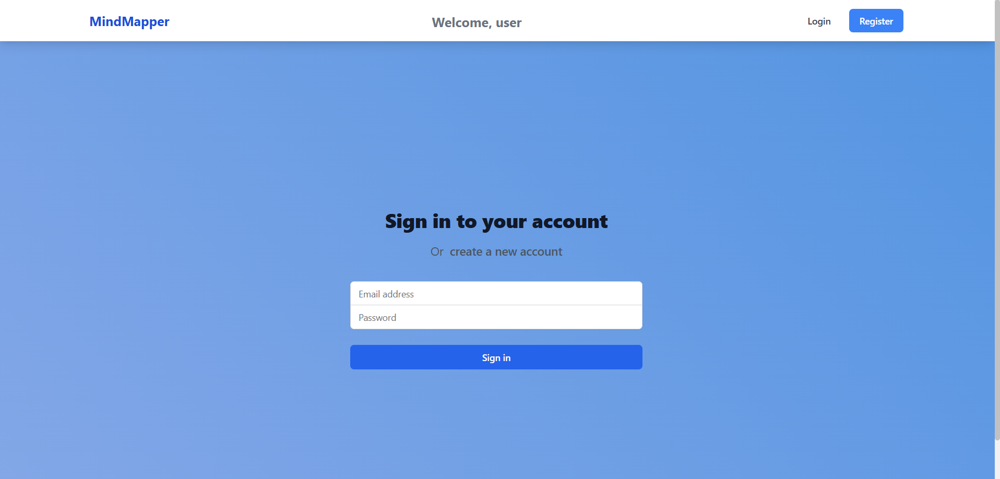
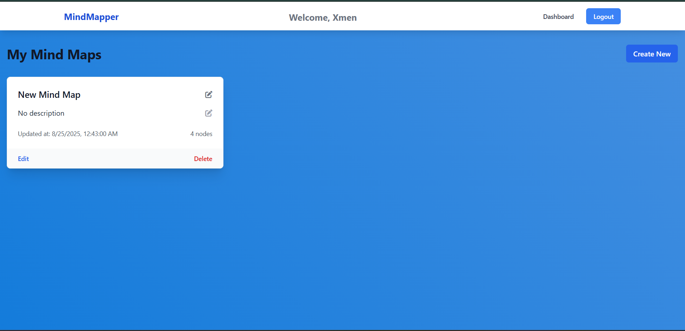
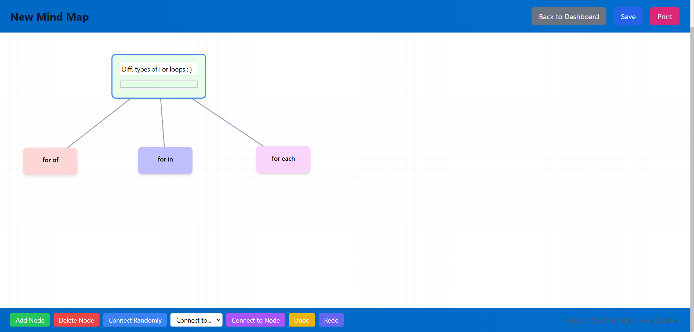

# Mind Map Builder

Mind Map Builder is a full-stack MERN application that allows users to create, edit, and manage mind maps visually. The project is organized into a client (frontend) and server (backend) with a clear separation of concerns.

## Table of Contents

- [Tech Stack Used](#Tech-Stack-Used)
- [Features](#features)
- [Screenshots](#Screenshots)
- [Project Structure](#project-structure)
- [Getting Started](#getting-started)
- [Environment Variables](#environment-variables)
- [Scripts](#scripts)
- [License](#license)
- [Deployment Link](#Deployment-Link)
- [GitHub Repo](#GitHub-Repo)

## Tech Stack Used

- React, Express, Node, MongoDB

## Features

- User authentication (register, login, JWT-based sessions)
- Create, edit, and delete mind maps
- Visual mind map editor with draggable nodes and connections
- Dashboard to manage all user mind maps
- Responsive UI with Tailwind CSS
- Protected routes for authenticated users

## Screenshots -







## Project Structure

```
Mind-Map-Builder/
│
├── .gitignore
│
├── client/                 # Frontend (React + Vite)
│   ├── .eslintrc.cjs
│   ├── index.html
│   ├── package.json
│   ├── postcss.config.js
│   ├── tailwind.config.js
│   ├── vite.config.js
│   ├── public/
│   │   ├── fontawesome.css
│   │   └── style.css
│   └── src/
│       ├── App.css
│       ├── App.jsx
│       ├── index.css
│       ├── main.jsx
│       ├── components/
│       │   ├── MindMapNode.jsx
│       │   ├── Navbar.jsx
│       │   └── ProtectedRoute.jsx
│       ├── context/
│       │   └── AuthContext.jsx
│       └── pages/
│           ├── Dashboard.jsx
│           ├── Login.jsx
│           ├── MindMapEditor.jsx
│           └── Register.jsx
│
├── server/                 # Backend (Node.js + Express + MongoDB)
│   ├── .env
│   ├── package.json
│   ├── server.js
│   ├── config/
│   │   └── db.js
│   ├── middleware/
│   │   └── auth.js
│   ├── models/
│   │   ├── MindMap.js
│   │   └── User.js
│   └── routes/
│       ├── auth.js
│       └── mindmaps.js
```

## Getting Started

### Prerequisites

- Node.js (v16+ recommended)
- npm or yarn
- MongoDB database (local or Atlas)

### Installation

1. **Clone the repository:**
   ```sh
   git clone https://github.com/yourusername/Mind-Map-Builder.git
   cd Mind-Map-Builder
   ```

2. **Install server dependencies:**
   ```sh
   cd server
   npm install
   ```

3. **Install client dependencies:**
   ```sh
   cd ../client
   npm install
   ```

4. **Set up environment variables:**
   - Copy `server/.env` and update with your MongoDB URI and JWT secret.

5. **Run the development servers:**

   - **Backend:**
     ```sh
     cd ../server
     npm run dev
     ```
   - **Frontend:**
     ```sh
     cd ../client
     npm run dev
     ```

6. **Open the app:**
   - Visit [http://localhost:3000](http://localhost:3000) in your browser.

## Environment Variables

Create a `.env` file in the `server/` directory with the following:

```
PORT=5000
MONGODB_URI=your_mongodb_connection_string
JWT_SECRET=your_jwt_secret
NODE_ENV=development
```

## Scripts

### Server

- `nodemon server.js` — Start backend with nodemon
- `npm start` — Start backend

### Client

- `npm run dev` — Start frontend dev server
- `npm run build` — Build frontend for production
- `npm run preview` — Preview production build

## License

This project is not licensed yet.


**Folder Reference:**
- [client/](client/) — React frontend
- [server/](server/) — Express backend

**Key files:**
- [`client/src/App.jsx`](client/src/App.jsx)
- [`server/server.js`](server/server.js)

## Deployment-Link

https://mindmap-builder-37x6icson-x-mens-projects.vercel.app

## GitHub-Repo

- https://github.com/10394xman/MindMap-Builder-Applicaiton

